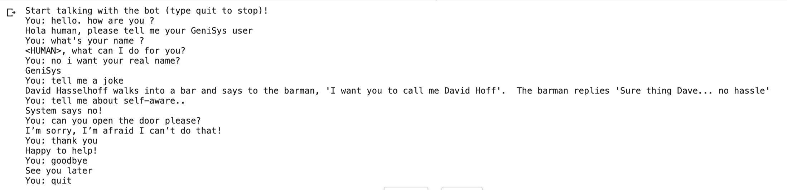

# simple-chatbot

This is a simple chatbot using MLP with `Keras`

Dataset source : https://www.kaggle.com/elvinagammed/chatbots-intent-recognition-dataset

Here is a sample of input JSON file:

```
{
  "intent": "Greeting",
  
  "text": [
          "Hi",
          "Hi there",
          "Hola",
          "Hello",
          "Hello there",
          "Hya",
          "Hya there"],
          
  "responses": [
          "Hi human, please tell me your GeniSys user",
          "Hello human, please tell me your GeniSys user",
          "Hola human, please tell me your GeniSys user"],
}
```
#### Steps of preprosseing this chatbot text:
- Remove Stopwords
- Spleling correction
- Word Tokenizing
- Stemming
- Make bag of words

#### Conversation whit this chatbot:

